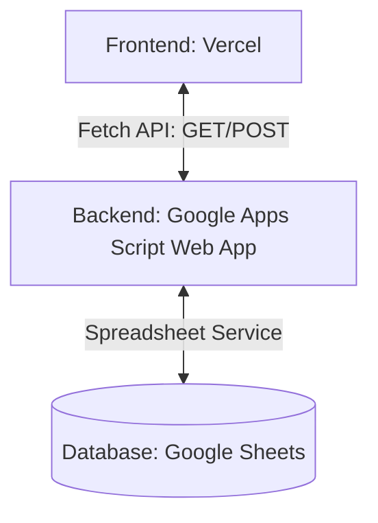

# Rencana Pembangunan Aplikasi Kasir (KASIRKU)

Proyek ini akan membangun aplikasi **Kasir (Point of Sale)** dengan arsitektur modern yang memisahkan Frontend dan Backend/Database.

## 🏗️ Arsitektur Aplikasi

1. **Frontend (Deploy: Vercel)**
   - Antarmuka pengguna (UI) untuk kasir melakukan transaksi, manajemen produk, dan melihat laporan.
   - Mengambil (fetch) dan mengirim data ke API Google Apps Script.

2. **Backend & Database API (Deploy: Google Apps Script)**
   - Kode diletakkan di Google Apps Script (GAS) dan dideploy sebagai **Web App**.
   - Berfungsi sebagai jembatan API untuk menerima request dari Frontend dan mengolah data di Google Sheets.

3. **Database (Google Sheets)**
   - Tempat penyimpanan seluruh data produk, transaksi, dan histori kasir.

---

## 📋 Rencana Tahapan Pengembangan

- [ ] **Tahap 1: Desain Database (Google Sheets)**
  - Tentukan tabel yang dibutuhkan (misal: `Produk`, `Transaksi`, `Detail_Transaksi`).
- [ ] **Tahap 2: Pembuatan API (Google Apps Script - Kode.js)**
  - Tulis fungsi `doGet(e)` dan `doPost(e)` untuk menangani request dari frontend.
  - Implementasikan fungsi CRUD (Create, Read, Update, Delete) untuk produk dan transaksi.
  - Sediakan mekanisme CORS agar frontend di Vercel bisa mengakses API.
- [ ] **Tahap 3: Pembuatan Frontend (Index.html & CSS/JS)**
  - Rancang UI Kasir yang modern, responsif, dan dinamis.
  - Integrasikan fetch API ke URL Web App Apps Script.
- [ ] **Tahap 4: Deployment & Konfigurasi**
  - Deploy backend Apps Script sebagai Web App (akses: *Anyone*).
  - Deploy frontend ke Vercel.
